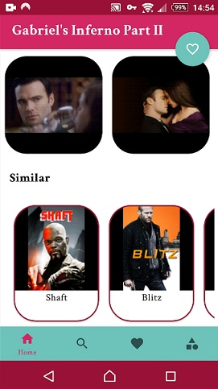

<h1 align="center"> Movotlin </h1>
<br>
<p align="center">
    
</p>


#### `Introduce`

Movotlin is an application that has been developed using modern Android development tools and features such as viewing movies by different genres, the ability to create a wish list, the ability to search for movies by name and genre, view It has information such as year of production, director, writer, actors, etc.


#### `Screenshot` 

<p align="center">
  
   
  <br>
   
   
  </p>
  
  
  
#### `Highlights`

<table align="center">
  <tr>
    <td><b>Light Theme</td>
    <td><b>Dark Theme</td>
  </tr>
  <tr>
    <td></td>
    <td></td>
  </tr>
</table>

  
  
### `Tools & Dependencies`
* Clean Ahitecture(MVVM)
* Single Activity
* Google Material Design
* Jetpack Paging Library
* Jetpack Navigation Component
* Jetpack Room Database
* Glide - Load Image
* Retrofit- Network Requests
* Dagger- Dependency Injection
* RxJava/RxAndroid- Reacttive Programming
* Kotlin DSL
* [Themoviedb API](https://developers.themoviedb.org/3/getting-started/introduction)

 
 
 ## Build/Running
- Create local.properties in root folder
- Get [TMDB API Key](https://developers.themoviedb.org/3/getting-started/introduction) and add to local.properties with "API.KEY" tag
```
   API.KEY="<INSERT_YOUR_API_KEY>"
```
- Add an empty field for other parameters: 
```
    signing.key.alias="<INSERT_YOUR_ALIAS>"
    signing.key.password="<INSERT_YOUR_PASSWORD>"
    signing.store.file="<INSERT_YOUR_ADDRESS>"
    signing.store.password="<INSERT_YOUR_PASSWORD>"
    signing.tvkey.alias="<INSERT_YOUR_ALIAS>"
    signing.tvkey.password="<INSERT_YOUR_PASSWORD>"
    signing.tvstore.file="<INSERT_YOUR_ADDRESS>"
    signing.tvstore.password="<INSERT_YOUR_PASSWORD>"
```
 

[](https://drive.google.com/file/d/1kU1G4afUGPCBxyfi0tZb8FYMaiadgjkI/view?usp=sharing)

[Show Demo Video](https://drive.google.com/file/d/1kU1G4afUGPCBxyfi0tZb8FYMaiadgjkI/view?usp=sharing)


[](#)

- [Download latest apk](https://github.com/OmidTaheri/Movotlin/blob/master/Apks/Movotlin-v1.3.0.apk)
- Github Release page: [Releases](https://github.com/OmidTaheri/Movotlin/releases)


[](https://www.linkedin.com/in/omid-taheri)
